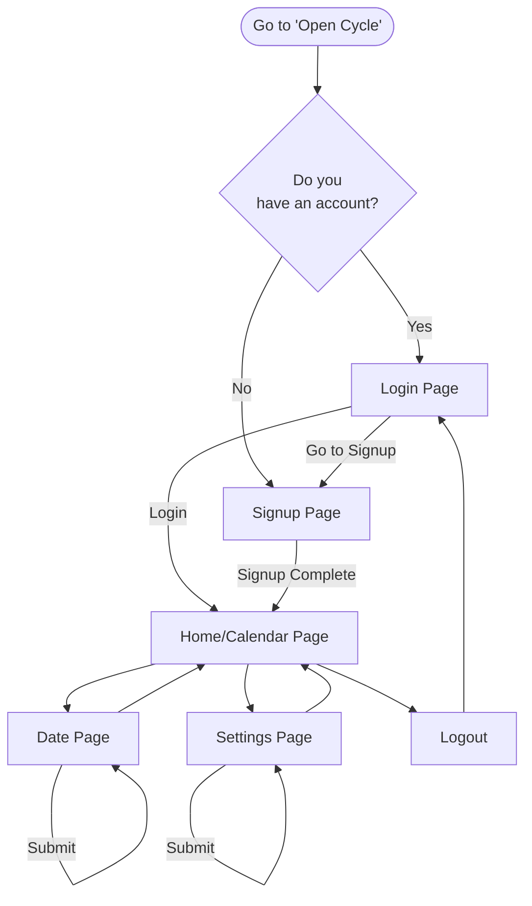

```mermaid
flowchart TD
    start([Go to 'Open Cycle']) --> Check{Do you <br>have an account?}

    Check -->|Yes| A[Login Page]
    Check -->|No| C[Signup Page]

    A[Login Page] -->|Login| B[Home/Calendar Page]
    A -->|Go to Signup| C[Signup Page]
    C -->|Signup Complete| B

    B --> E[Date Page]
    B --> G[Settings Page]
    B --> H[Logout]

    E -->|Submit|E
    E --> B
    G -->|Submit| G
    G --> B

    H --> A
```
